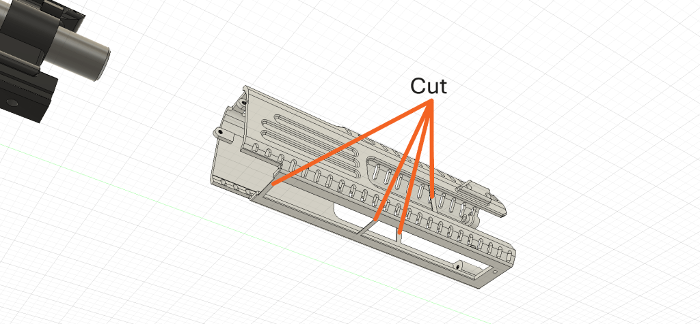
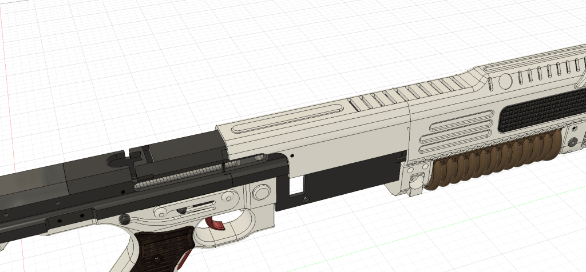
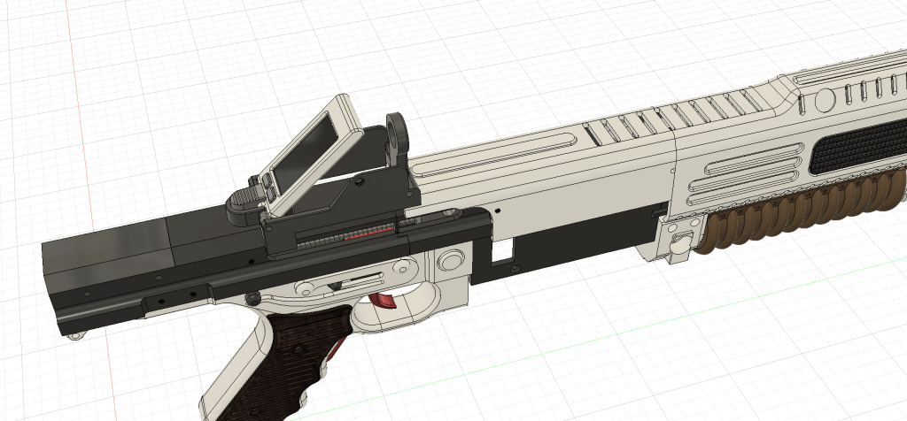
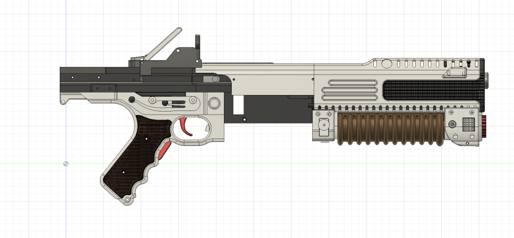

# F44AA Base assembly

Updated23/03/2025

Start with the upper receiver and screw the tactical rail in.

screw the speaker mount to the tactical rail

You will need to put the upper shroud mount on the barrel and then screw it in, then screw in the front barrel mount.

Slide the gas regulator onto the tactical rail and screw it in

Cut the 4 supports off the front shroud

Screw in sling clips

Slide the grip on and the torch. screw the torch in with a single screw through the front shroud

Slide in the barrel vent and screw it in

Add in the breech assembly to the upper receiver

Slide the completed lower assembly into the upper receiver

Add in the middle shroud

Slot the auto aim in the top of the receiver

