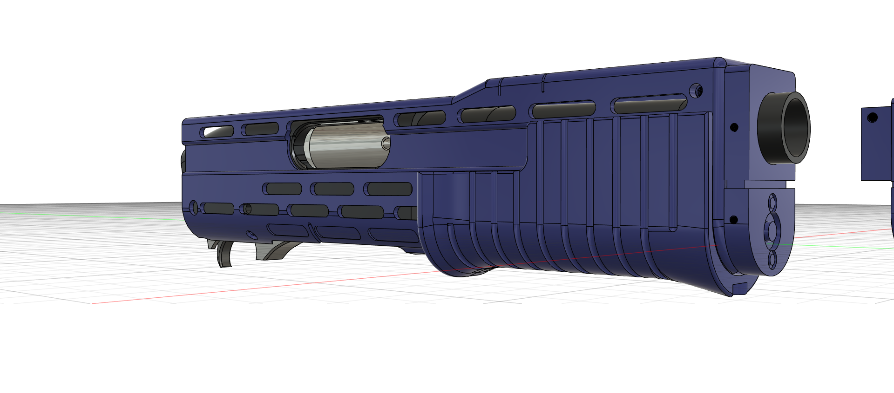
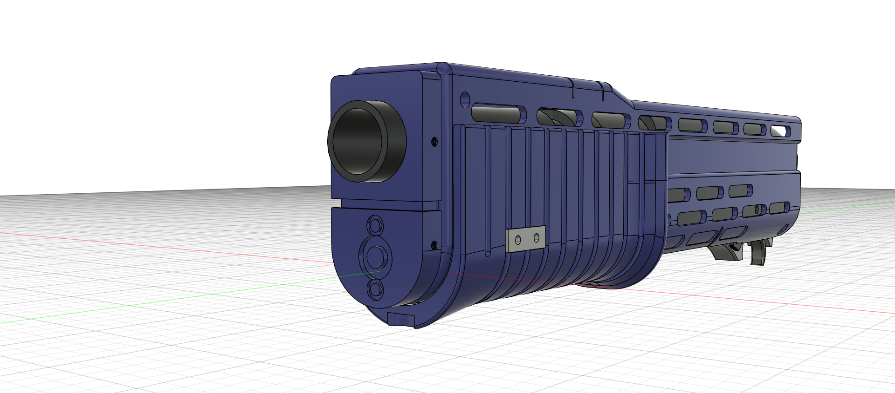

The only change with the Remington 2.5 is the reciever is taller, bringing it more inline with accepted specs, and the removal of the lower tube screw on cap.

1. Glue the lower tube into the reciever (its notched).
2. Assemble the trigger assembly and upper barrel as per the V2 documentation, Slide it into the SPAS cage and secure the front block with 2x M4 x 6mm countersunk and 4 x M3 x 6mmgrub screws.

   
   
   
   
   
