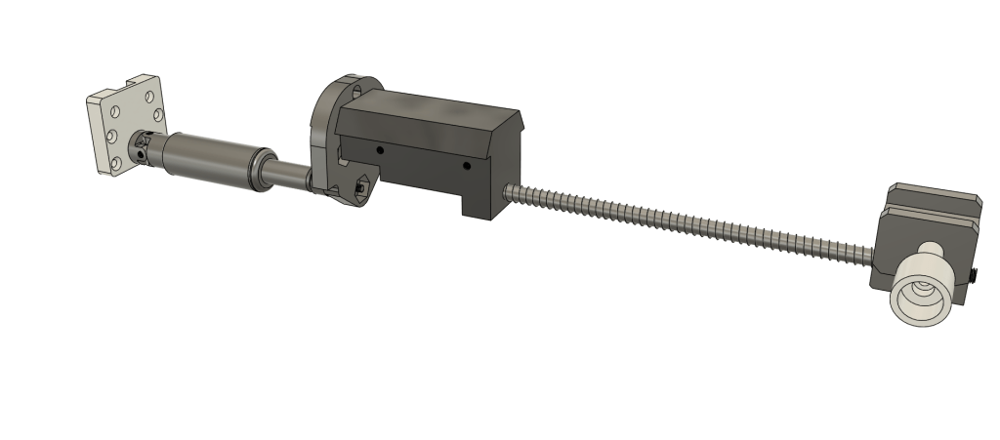
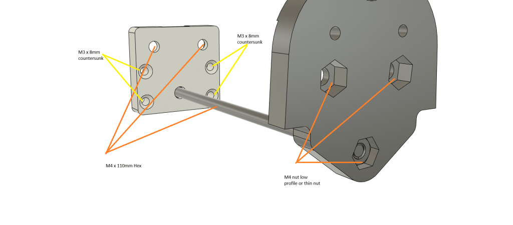
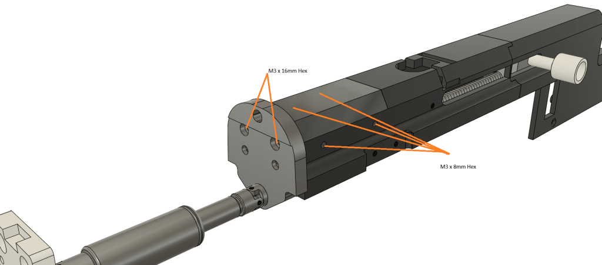
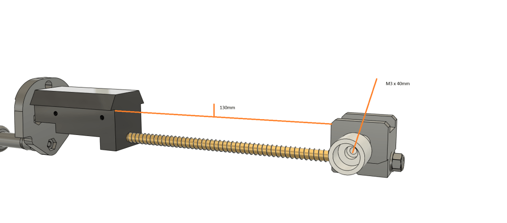

# F44AA – Rear Piston Assembly

Updated15/07/2025

M3 x 8mm = 4 countersunk

M3 x 8mm = 4 hex

M3 x 16mm = 2 hex

M3 x 40mm = 1 hex

M4 x 110mm = 3 Hex

M4 x nut low profile = 3

Loctite for M4 low profile nut

M5 Threaded rod = 172mm

M5 Locknut = 1

M5 Washer = 1

5.56mm brass tube = 158mm

