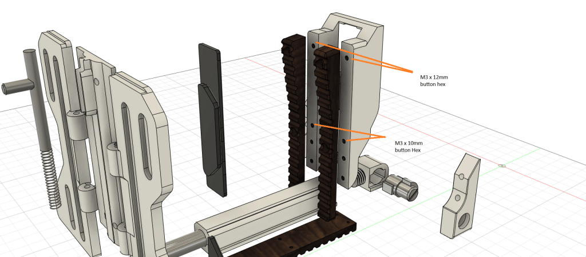
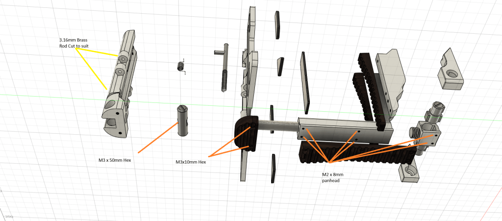
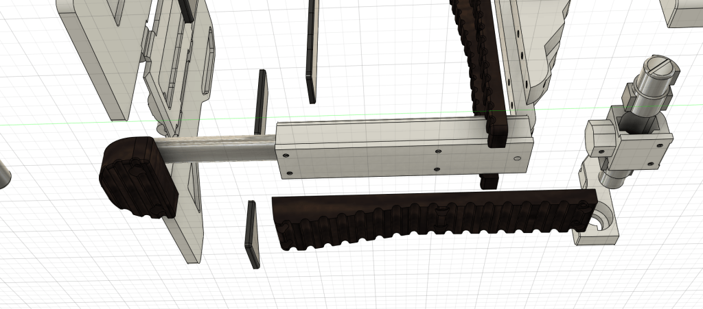
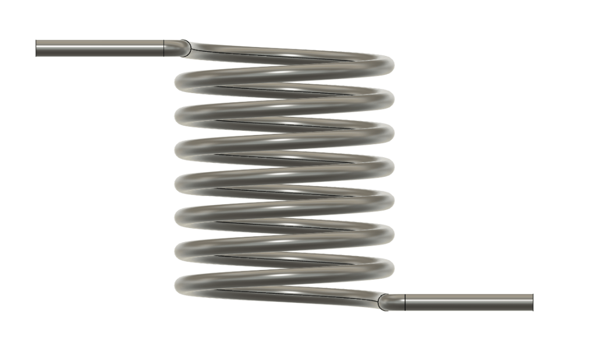
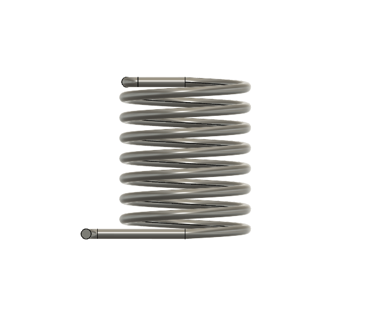
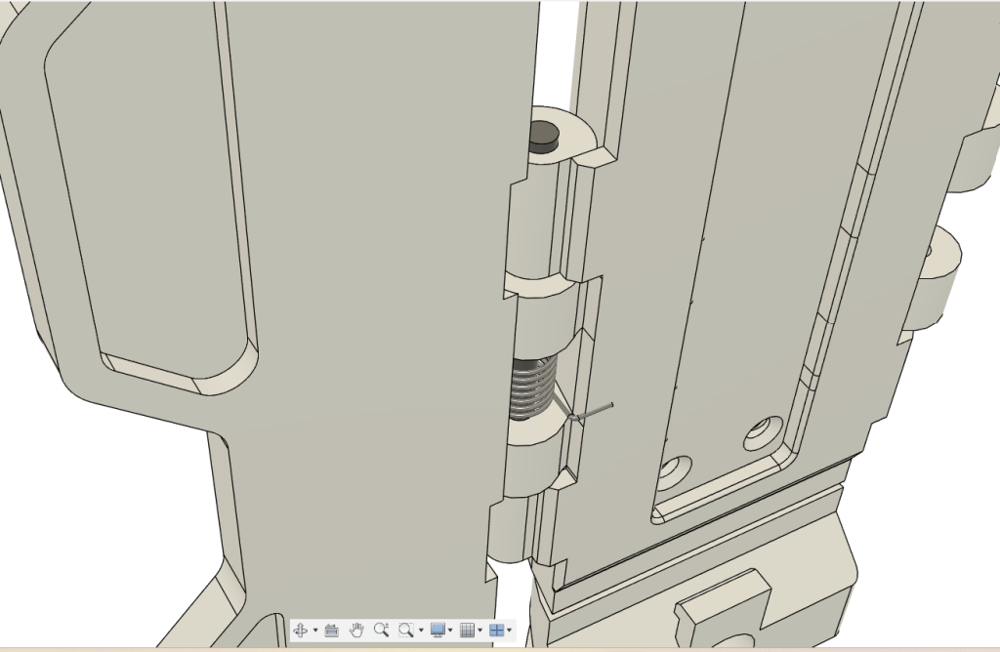
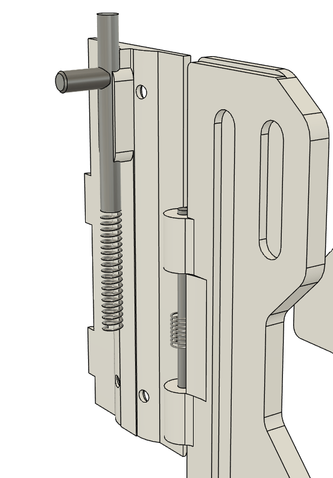

# F44AA – Rear Stock

Updated14/07/2025

M3 x 50mm = 1 Hex

M3 x 12mm = 4 Hex

M3 x 12mm = 2 Button Head Hex

M3 x 10mm = 1Hex

M3 x 8mm = 2 Hex

M3 x 6mm = 4 Countersunk

M2 x 8 mm = 6 Panhead

3.16mm Rod to suit

Wing Spring Dimensions 10mm x 6mm x 0.6mm

Stock lock Spring 32mm x 5mm x 0.6mm

