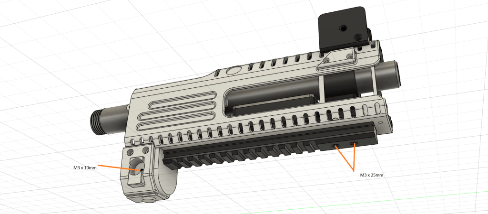
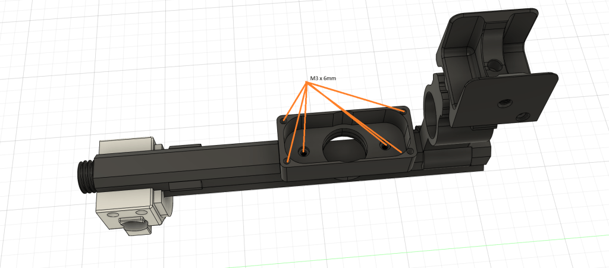
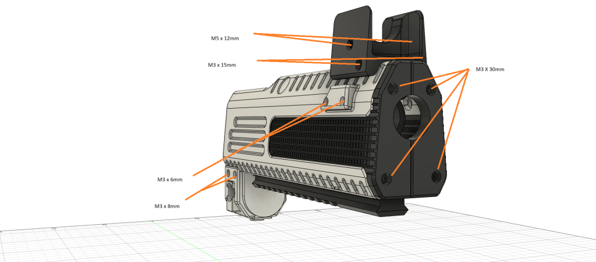
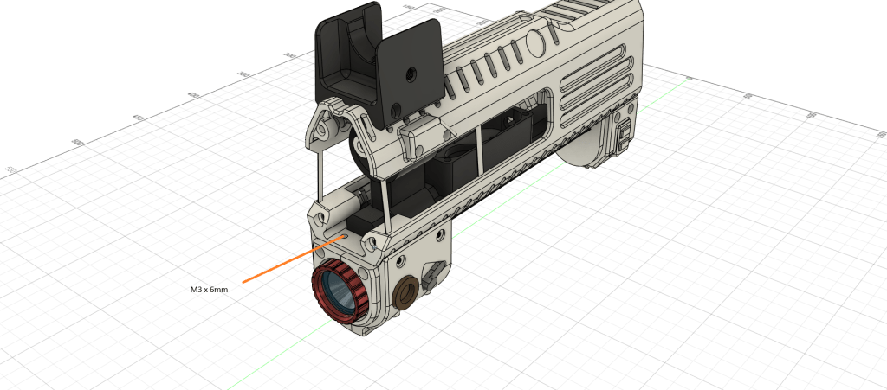
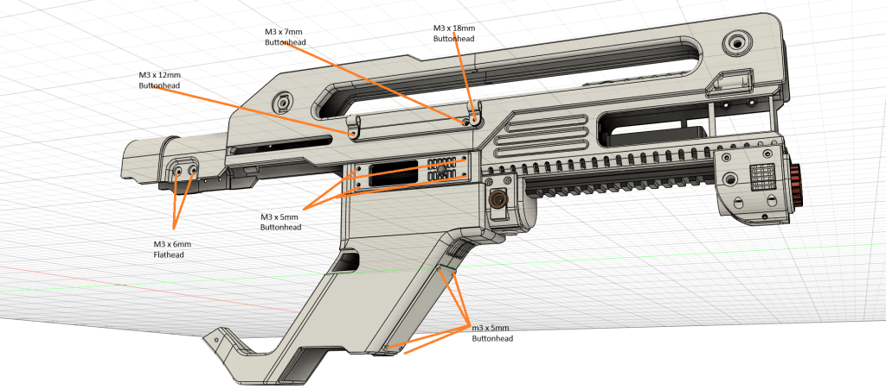

# F44AA -Shrouds

Updated07/07/2025

* M3 x 5mm = 8 x Buttonhead Hex
* M3 x 6mm = 13 Hex
* M3 x 6mm = 4 Countersunk Hex
* M3 x 6mm = 4 Flathead
* M3 x 7mm = 2 Buttonhead Hex
* M3 x 8mm = 4 Hex
* M3 x 10mm = 1 Hex
* M3 x 12mm = 2 Buttonhead Hex
* M3 x 15mm = 2 Hex
* M3 x 18mm = 2 Buttonhead Hex
* M3 x 25mm = 2 Hex
* M3 x 30mm = 4 Hex
* M5 x 12mm = 4 Flathead Hex

