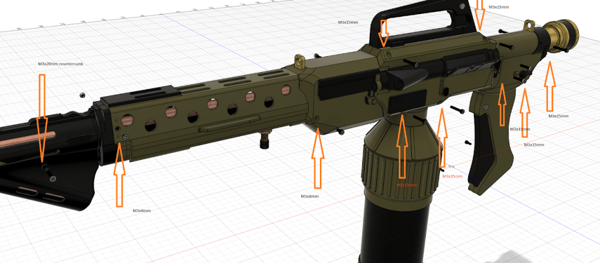
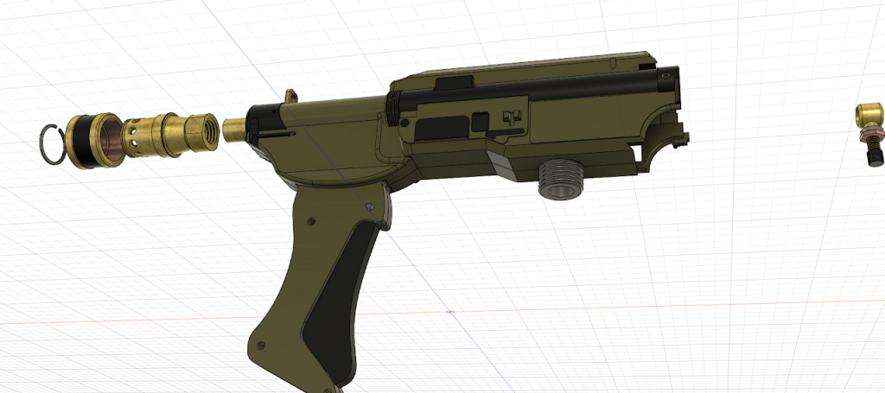
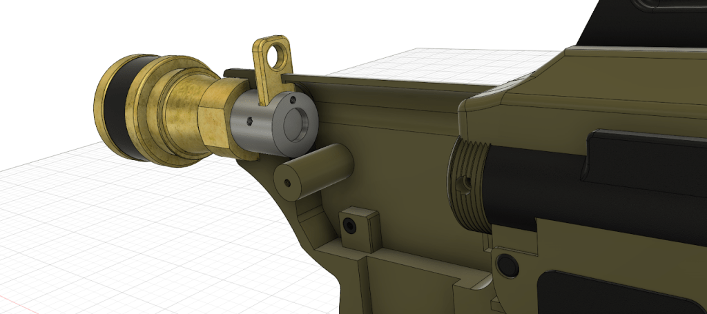
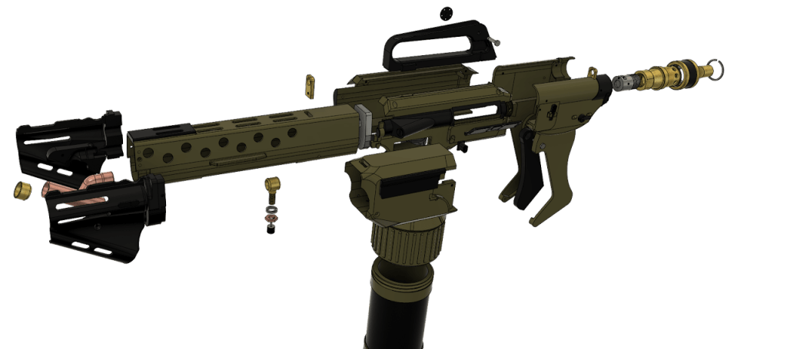

# Assembly M240

Updated05/11/2024

BOM List of screws

M3 x 15 = 8

M3 x 8 = 5

round head

M3 x 8 = 2

countersunk

M3 x 4 = 3

M3 x 20 = 1

You will need two lengths of copper pipe 12.7mm (1/2 inch)

390mm and 321mm.

small pen spring for the trigger.

