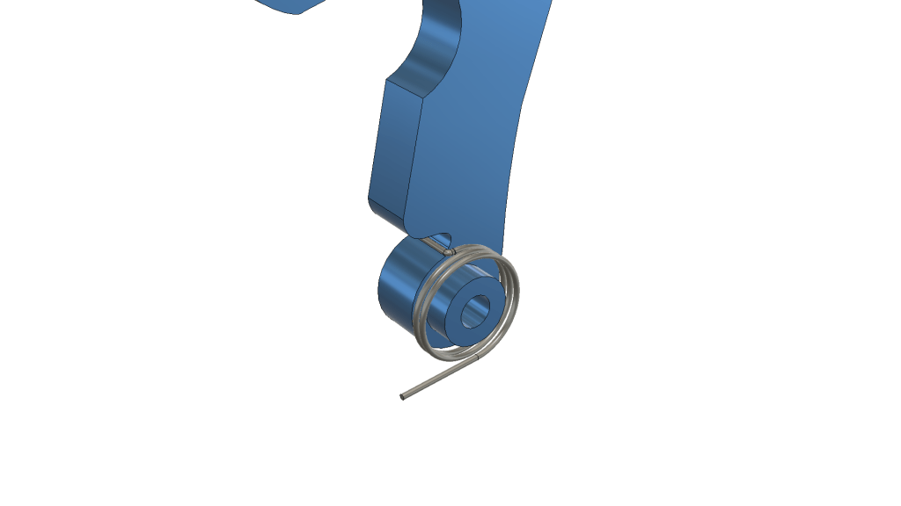
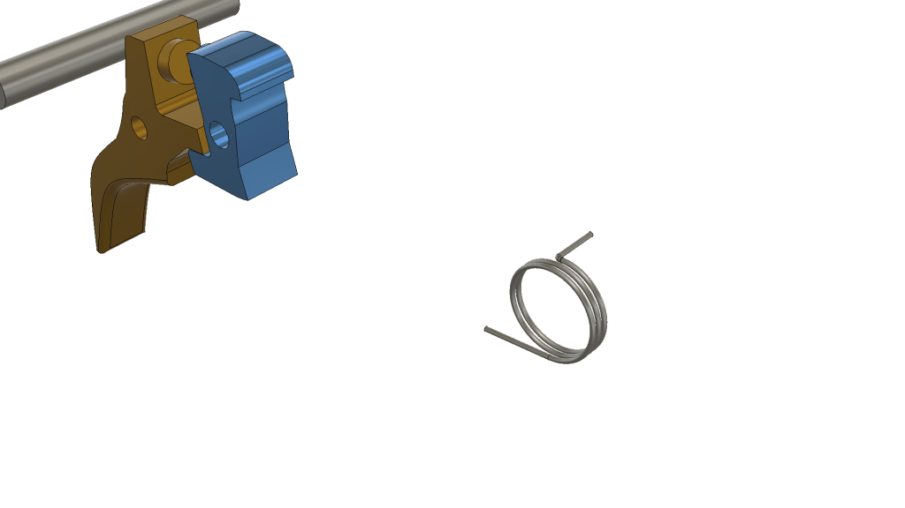

# M41A Mk2 U1 Springs

Updated13/12/2024

## U1 Hammer spring

##### **Spring size is roughly 0.5mm thickness and 9 – 9.5mm OD**

## Other Springs

#### Trigger spring 0.5mm 6mm OD

#### Gate spring 0.5mm 4.5mm OD

