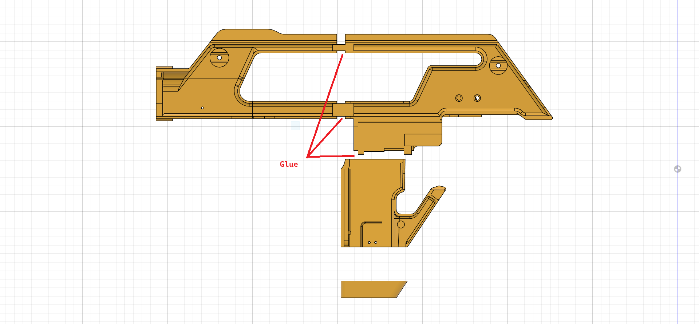
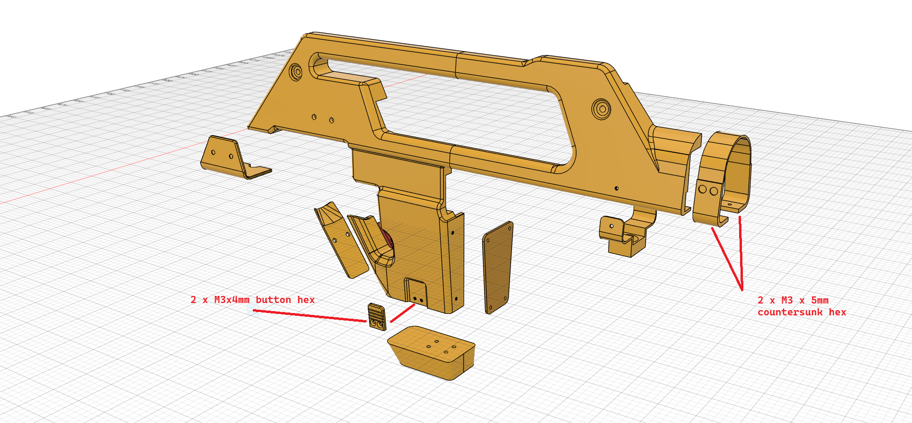

# V3 Shrouds

The V3 shrouds have been redesigned to fit Airsoft M41As and airsoft metal magazines. They also match SD Studios mag bases.

They print in three pieces and are glued together. The lugs are recessed to make alignment easier.

The rear clip is now one piece. The mag-well tabs are removable and secured with two M3×4 mm bolts.

