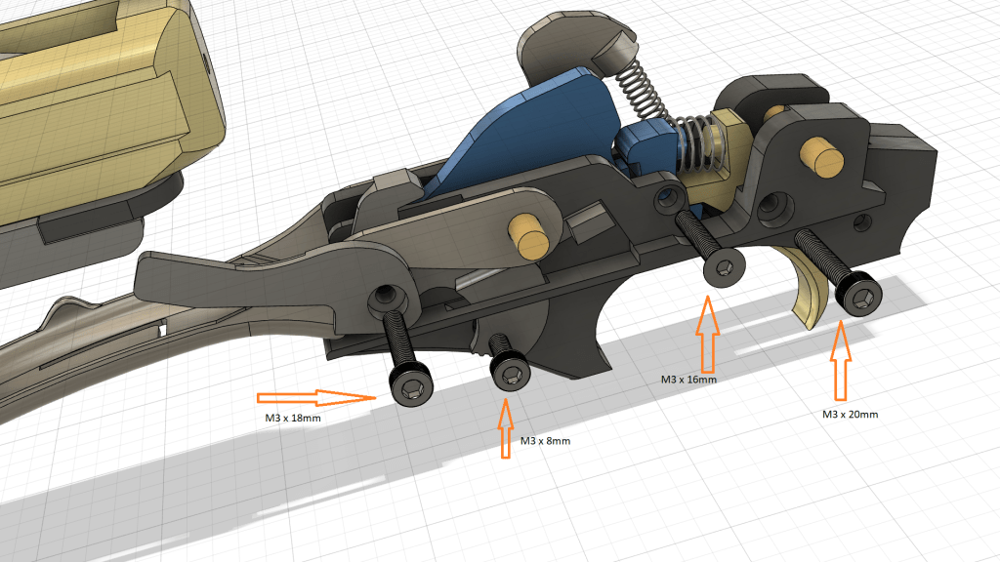
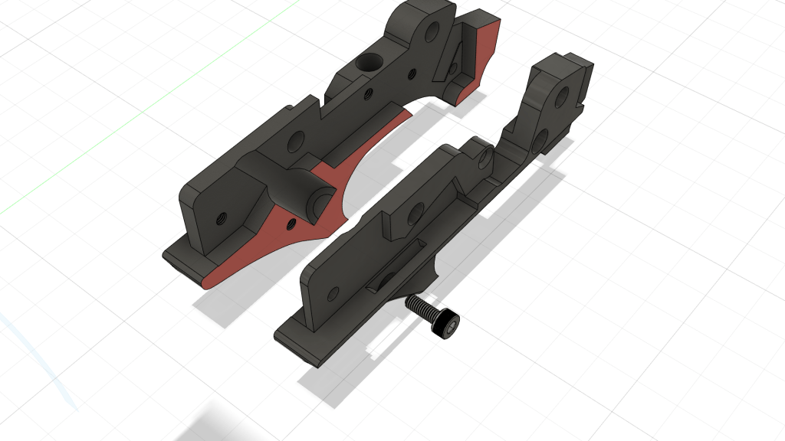
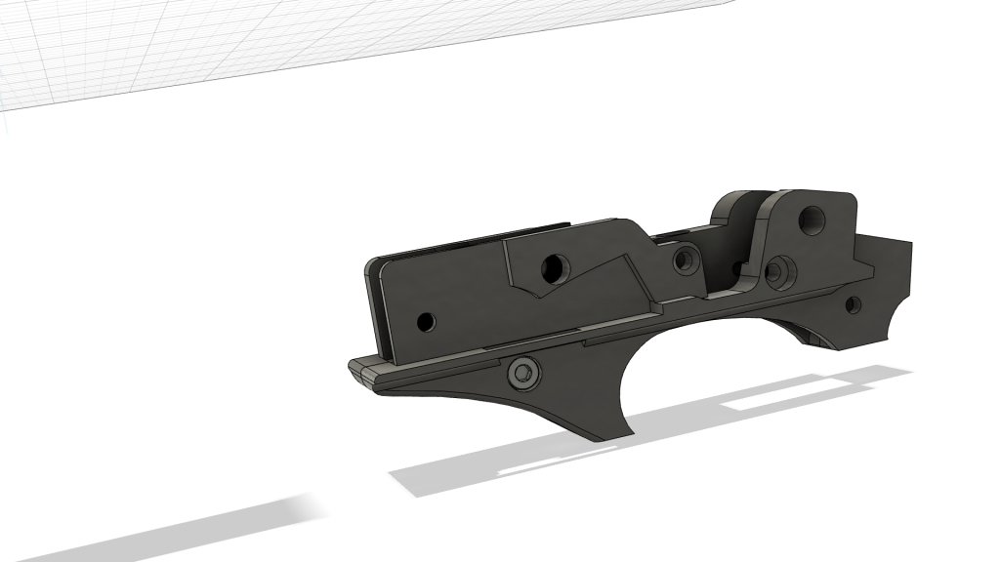
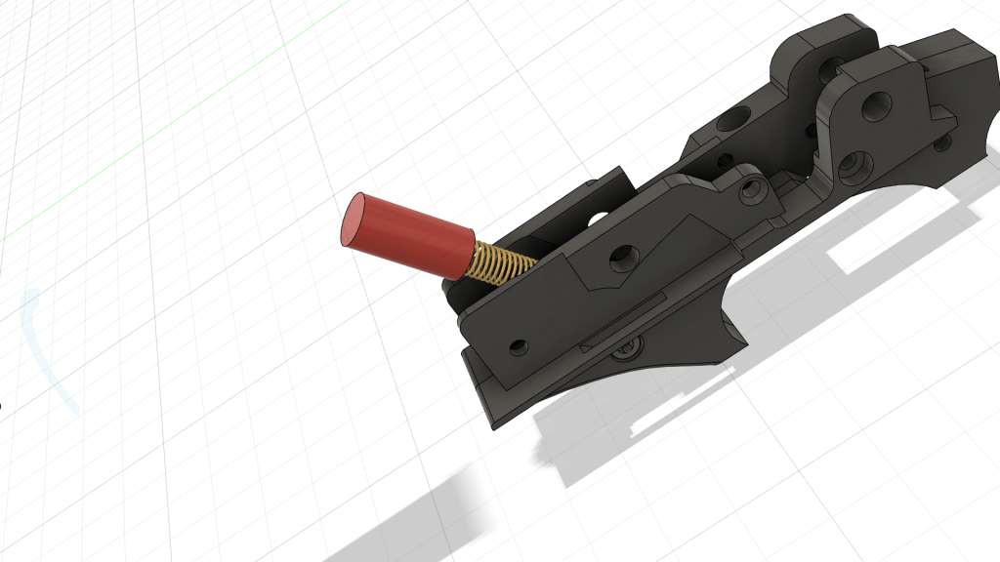
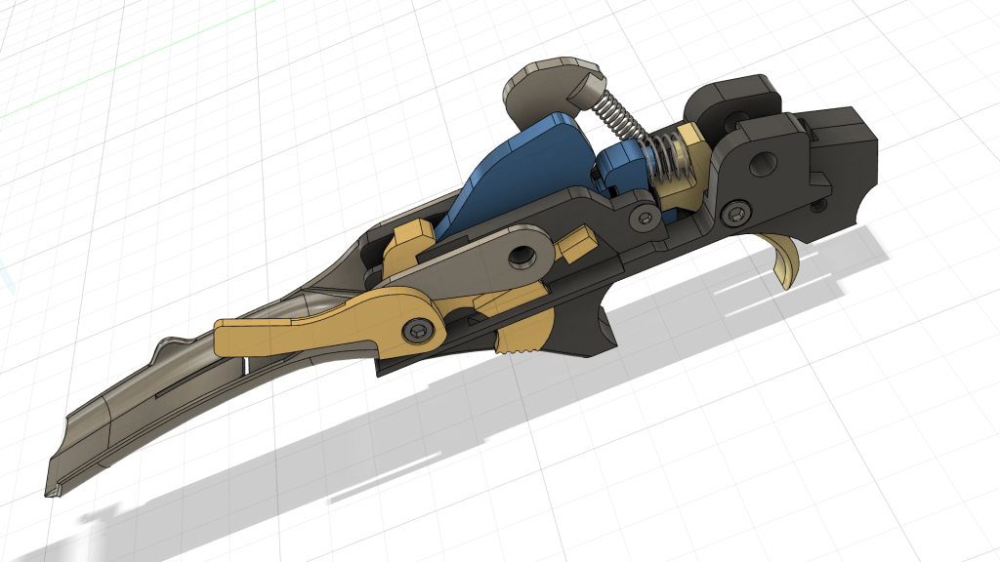
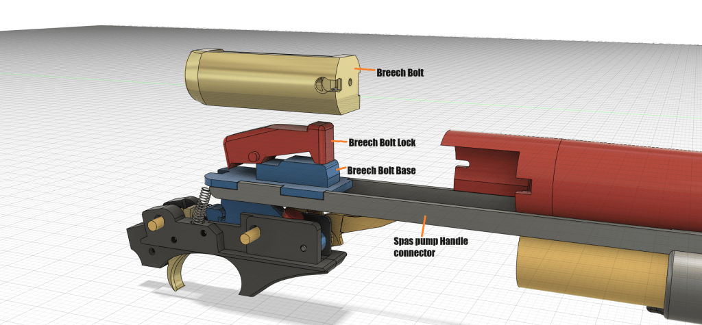
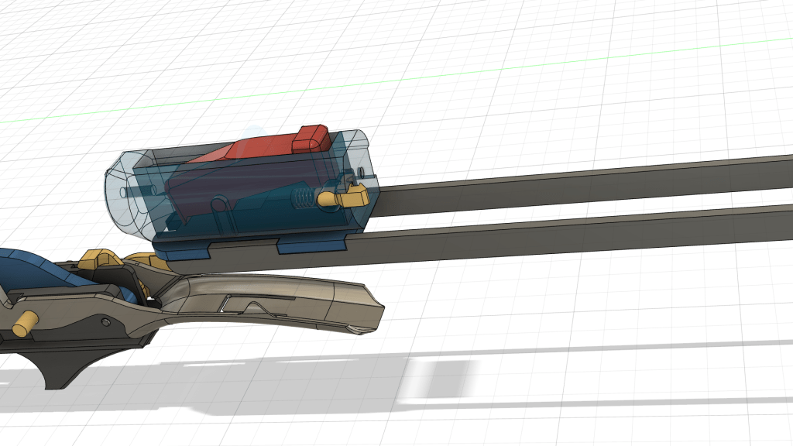
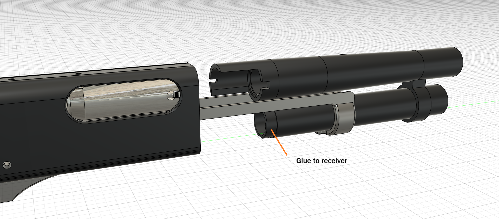
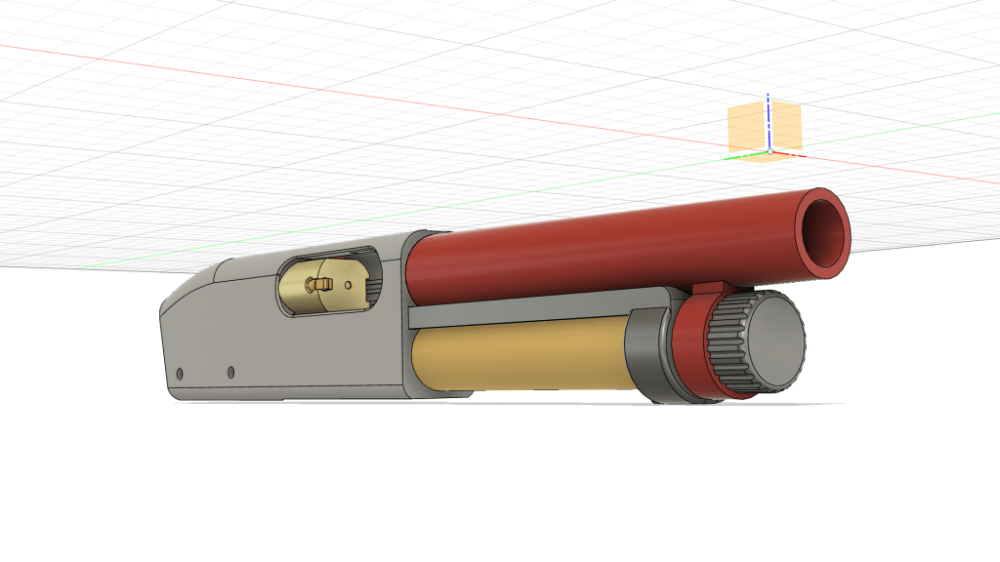
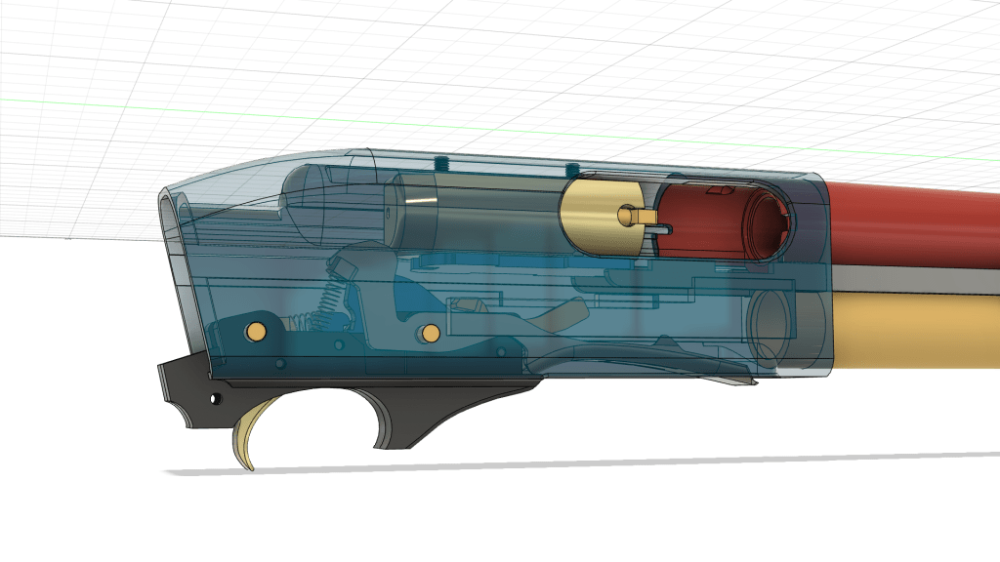

# Assembly – Remington

Updated02/11/2024

Start by glueing the two trigger assembly halves together, and then screw in the a M3x8mm hex to give it some strength.

The M3x8mm is not absolutely needed, but may help to keep things together.

Add the hammer pusher and spring in

Wiggle the carrier stop in and it should keep the hammer pusher in place

add the hammer and push down the hammer pusher. Bolt everything up – check fit, things should move freely

Slide the Breech assembly into the reciever

Add both barrels in 
* Glue the lower barrel in with CA or super glue
  The upper barrel is NOT glued in

Screw on end cap to keep it all tight

Insert the trigger assembly and secure everything with either two 6.3mm x33mm brass rod or used the 3d printed ones.

