# Assembly – Thompson

Updated01/11/2024

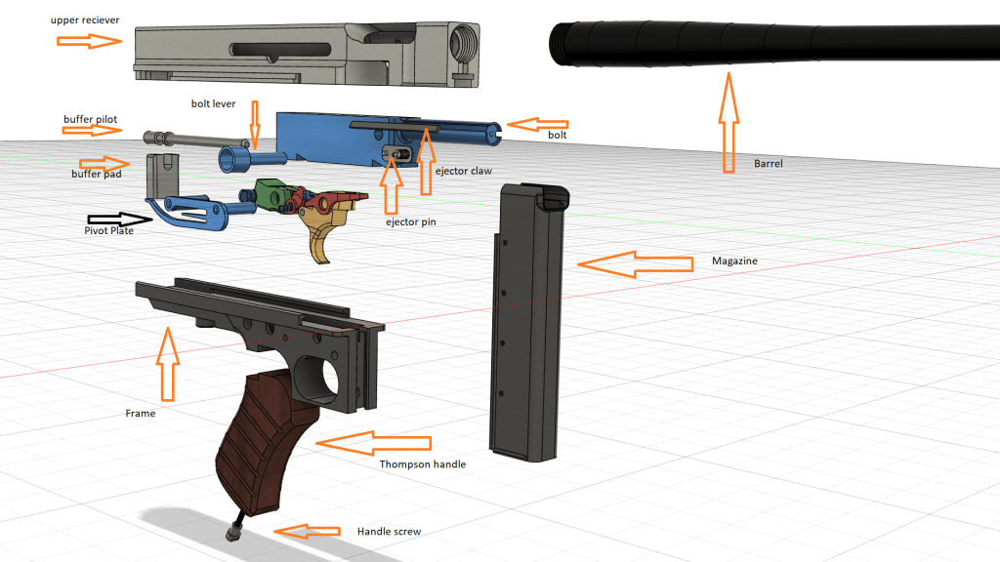

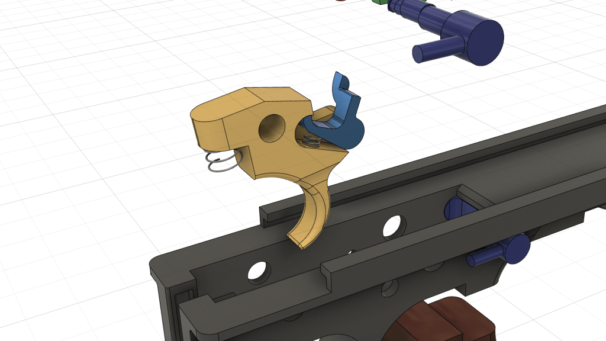

Insert the disconnector spring, trigger spring  and disconnector into the trigger

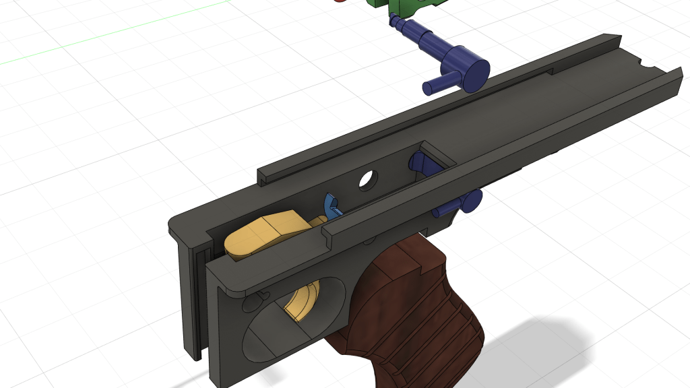

## Place the trigger assembly and safety latch into the frame

### **Combine the sear and sear cont and insert the sear** **spring**

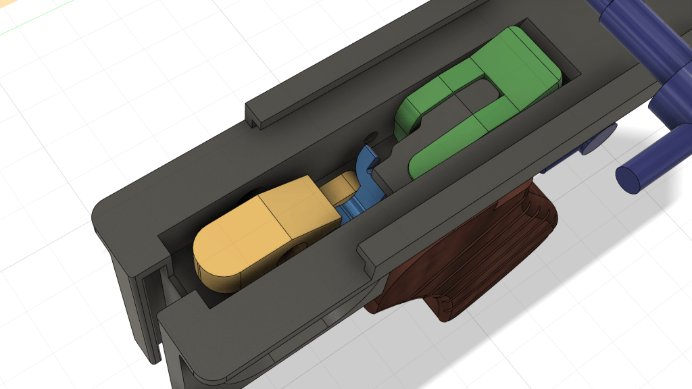

### place in rear of Frame

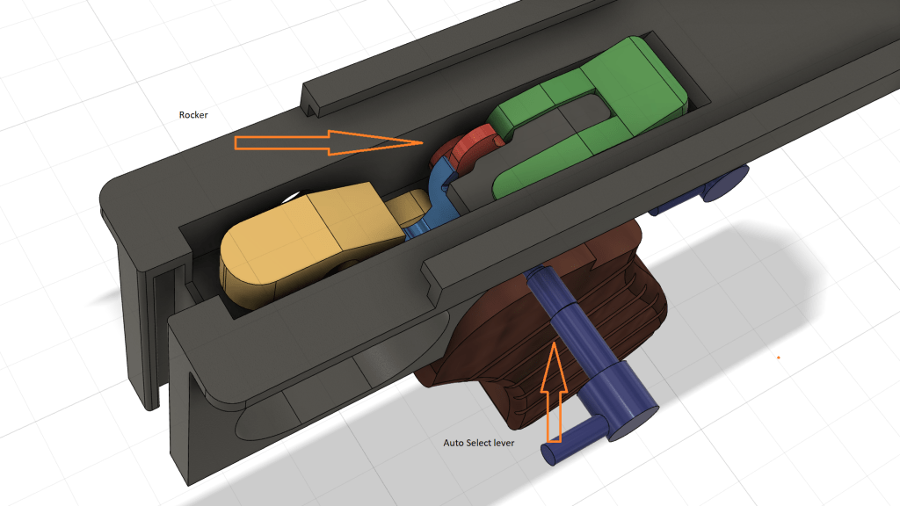

Insert the Auto select lever and the rocker into the frame

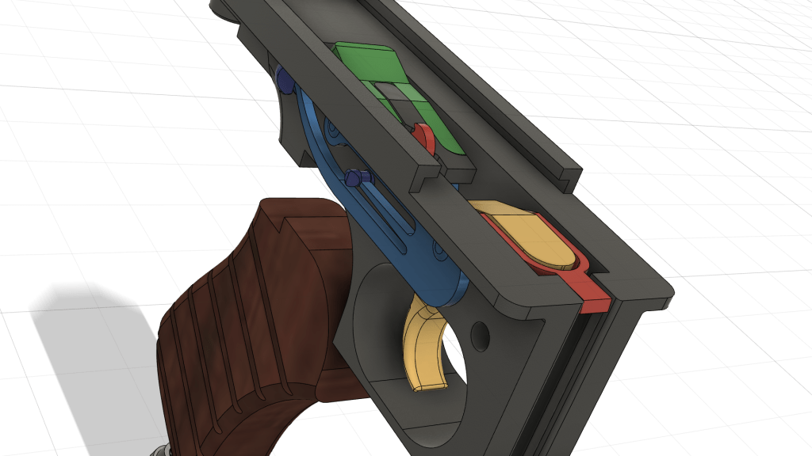

Hold down everything in the frame and align the holes and then insert the pivot plate

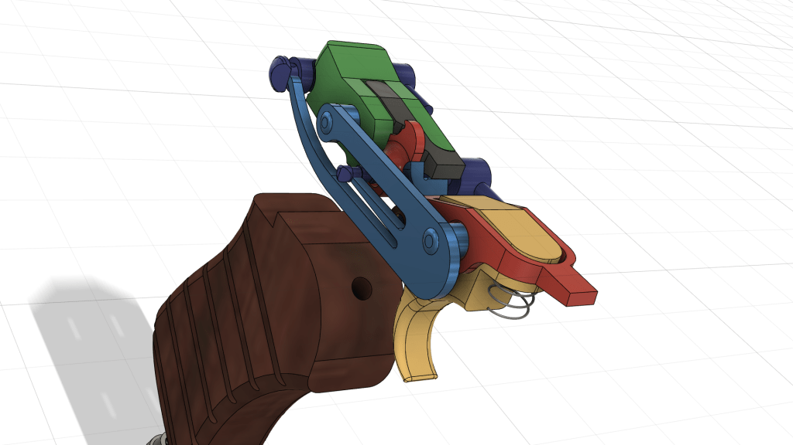

The pivot plate fingers should sit underneath the safety latch and the auto select lever, with slight pressure.

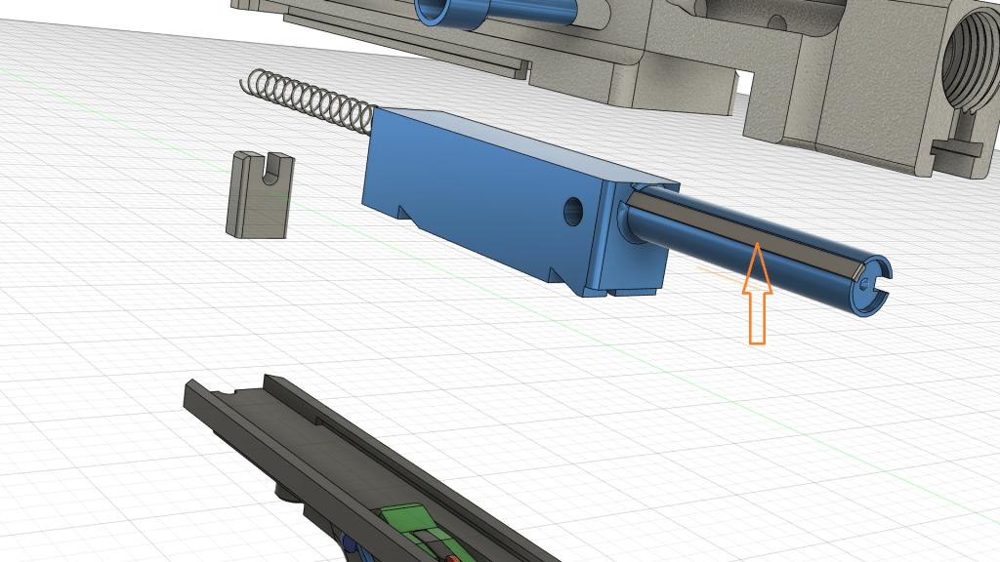

Glue the Thompson exjector claw into the bolt

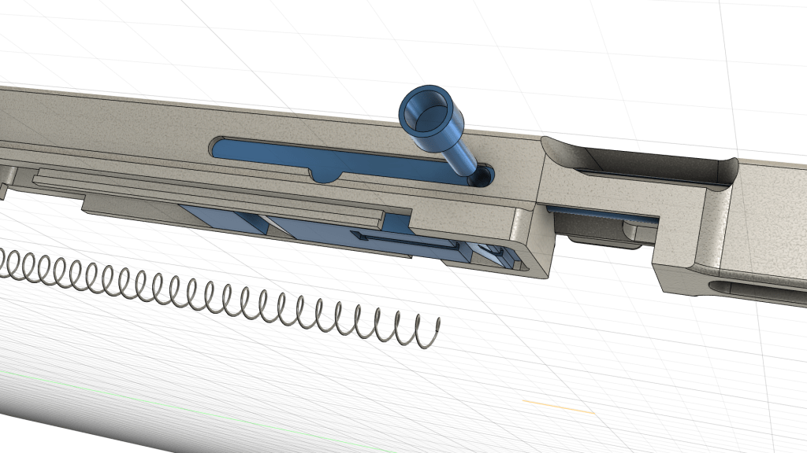

insert the bolt into the upper reciever and push in the bolt/charge  lever in. Check that the bolt moves back and forth freeley. If not sand the inner reciever and bolt more.

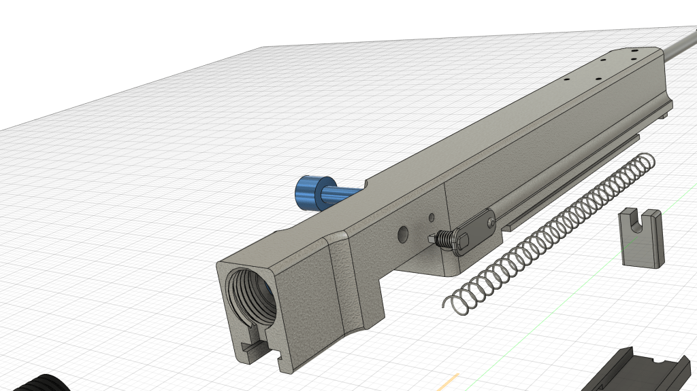

Glue the ejector pin in

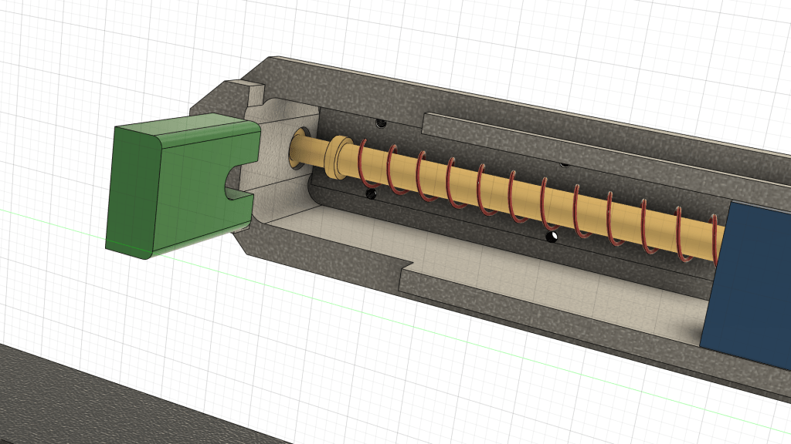

Insert the spring, push the buffer pilot through the end of the reciever and through the spring.

hold in place with the buffer pad.

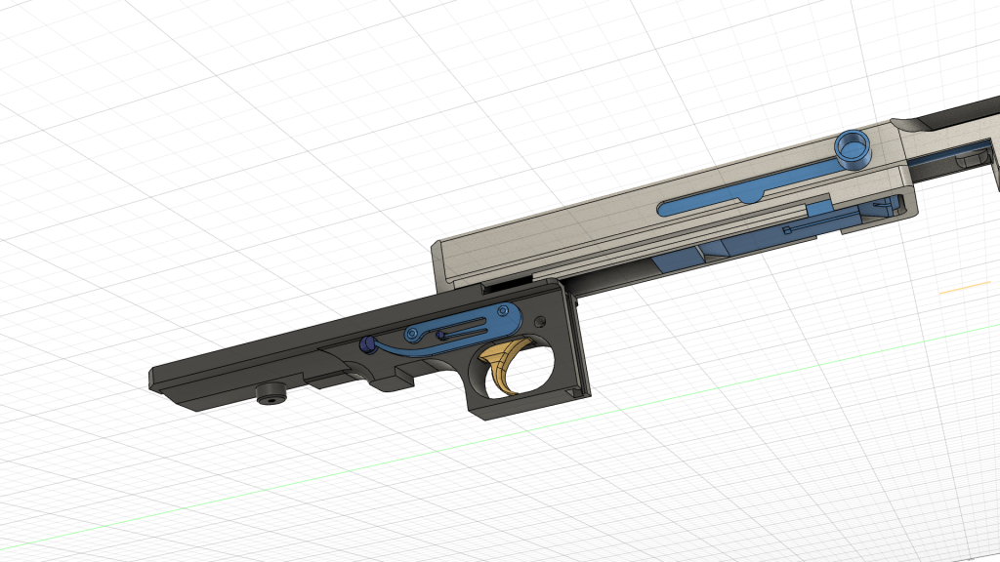

Slide the frame on from the back – depress the trigger while doing it to keep the trigger assembly flat so it will slide together smoothly

