# M41A Electronics install

Updated19/12/2024

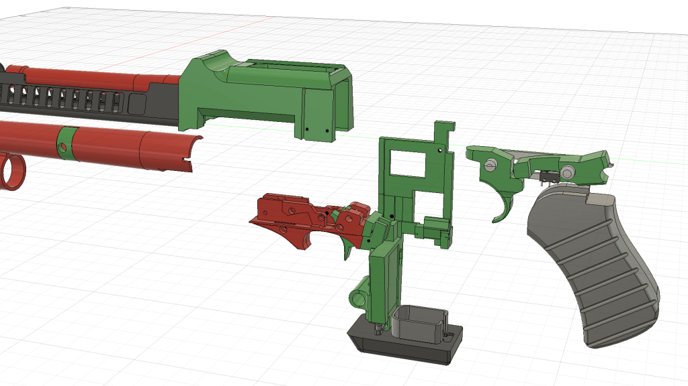

**Start by slotting the 2LED into the remington barrel.**

**Swap out the remington trigger with the new one and screw on the microswitch with the supplied M2 scews**

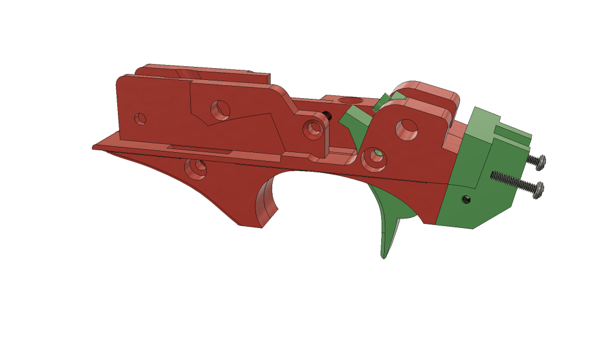

Assemble your remington as normal and insert into the SPAS cage

try and keep the wire in the lower recess of the spas cage

**Screw the vent holder on securing the remington and add in the short barrel threading the 1LED through it and slot the speaker box on top**. **screw your front barrel vent on also**

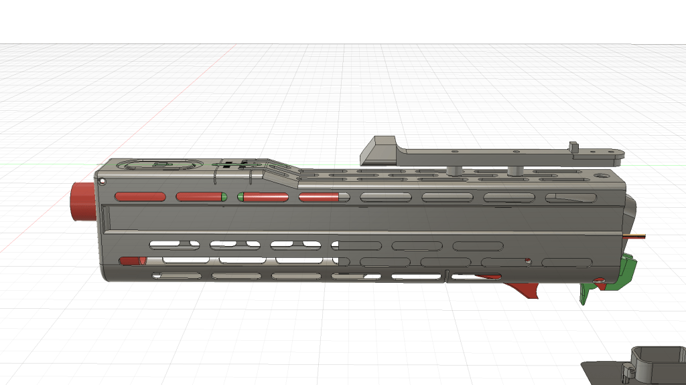
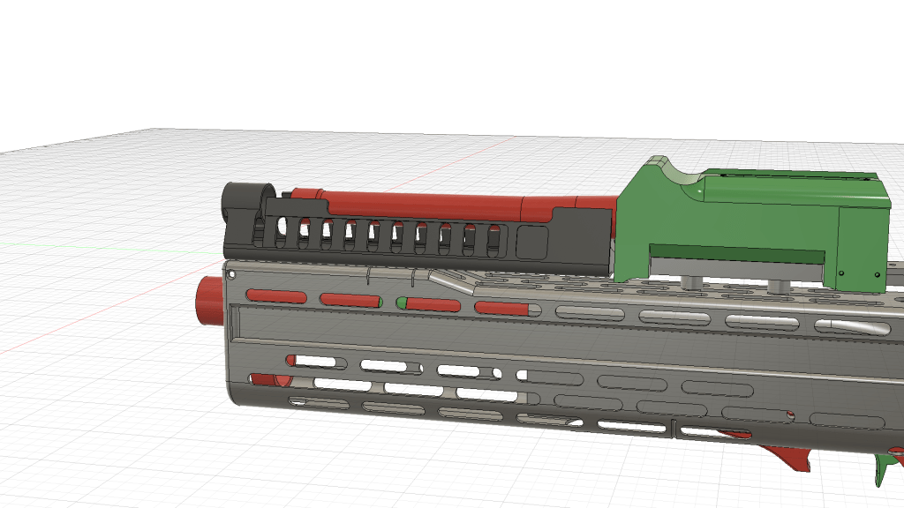

**Place the counter frame in the right shroud, it lines up with the 3 locating lugs on the shroud**.

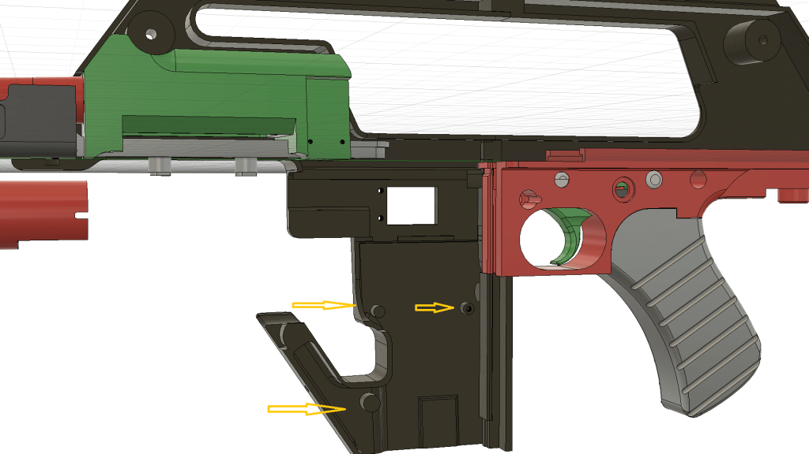
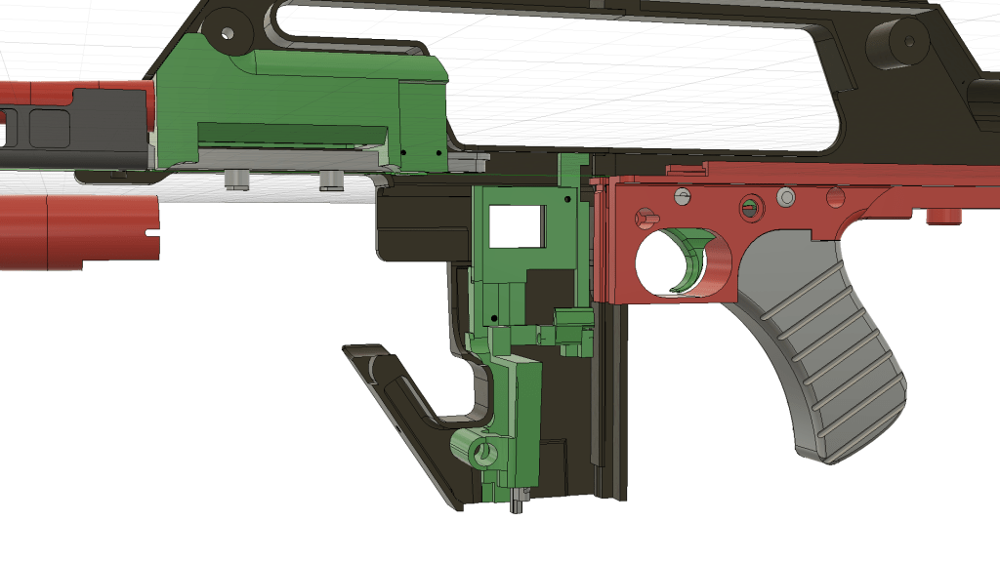
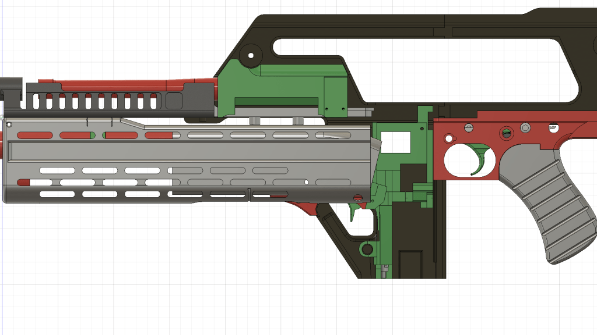

**Insert the fake selector tip into the thompson frame**

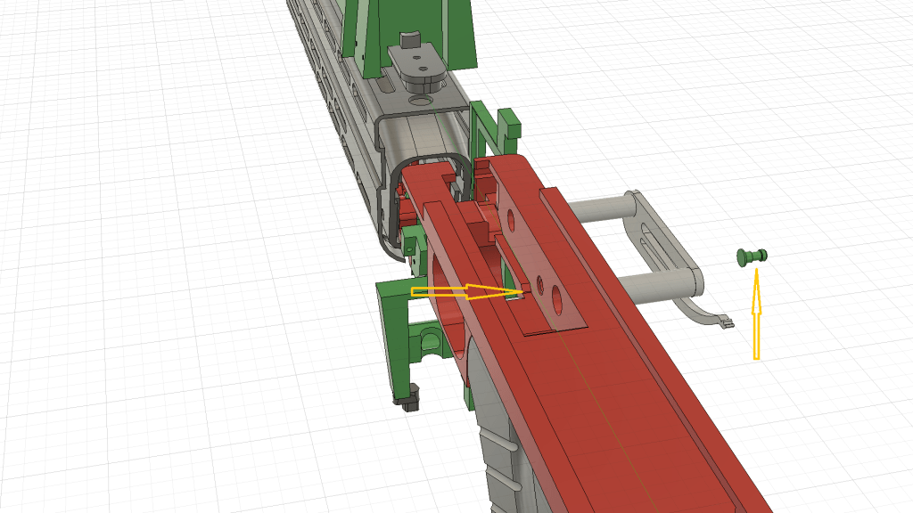
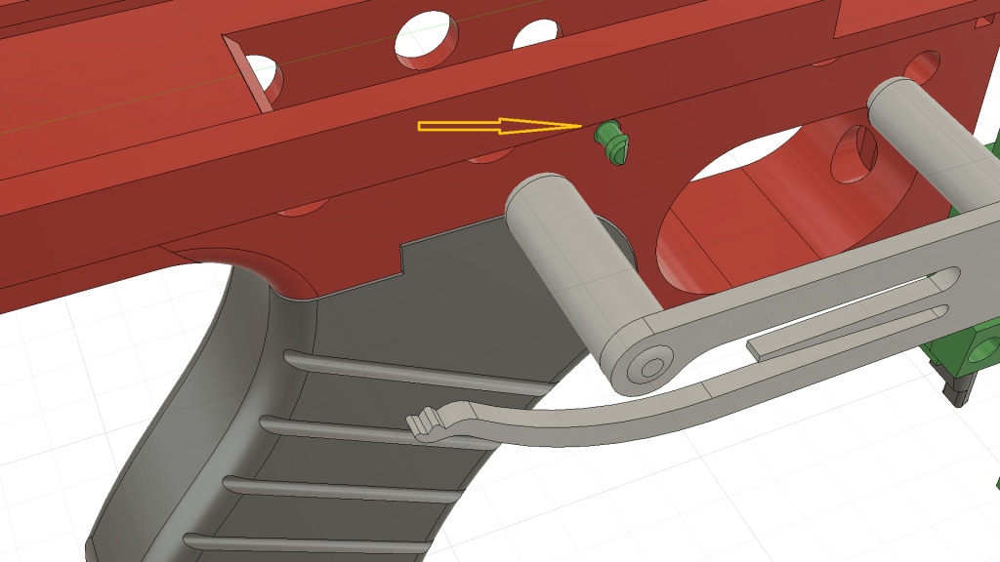

**Add in the thompson trigger pcb and secure it with the nut on the potentiometer**. **Insert the pcb in upside down first, give it a little push down and then rotate it to the correct direction.**

**Attach the loom and route it around the side of the microswitch and into the channel at the front**

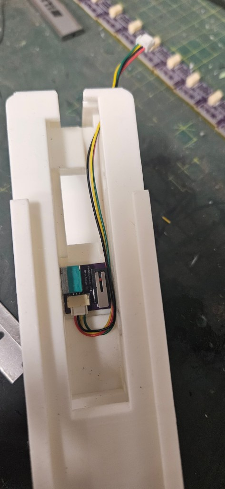

**Add the springs into the trigger and sear** **and secure with pivot plate**

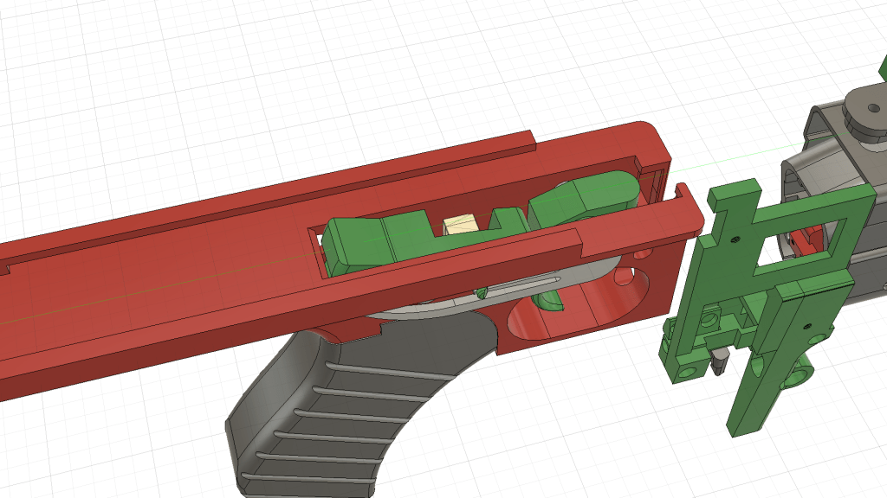

