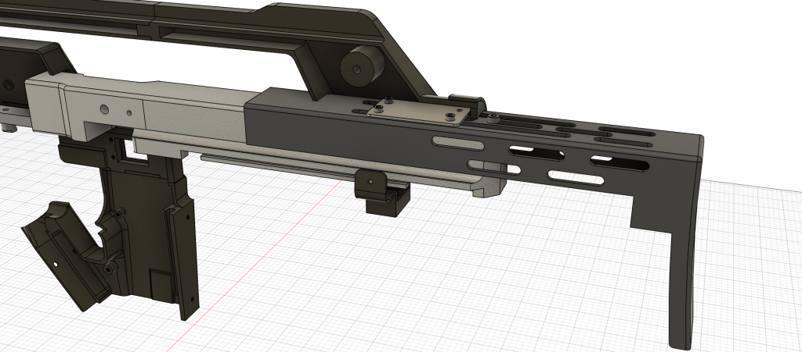
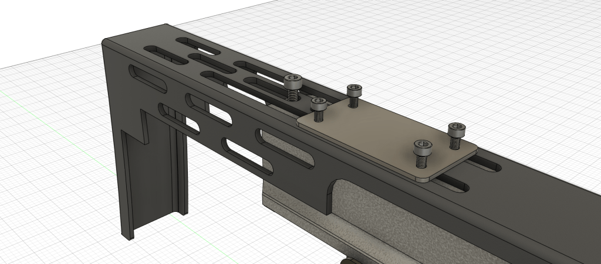
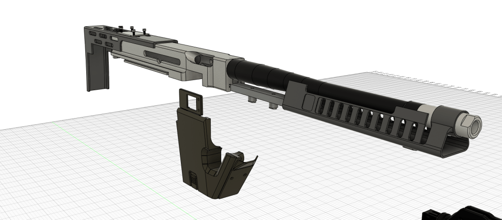

# Vent and Stock

Updated25/02/2025

**Parts needed – Thompson zip**

* Thompson barrel choke
* Vent and spas bracket holder
* Barrel full length

**Shrouds and misc zip**

* either 8 hole or 10 hole barrel vent

**SPAS Cage zip**

* base for vent

**Shrouds and misc zip**

* Rear stock
* Stock clamp

